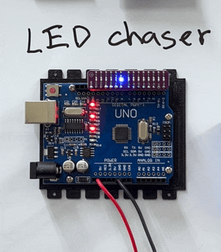
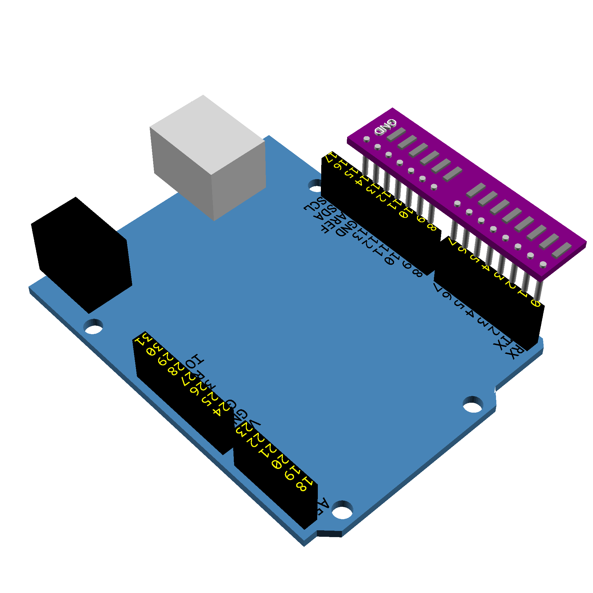
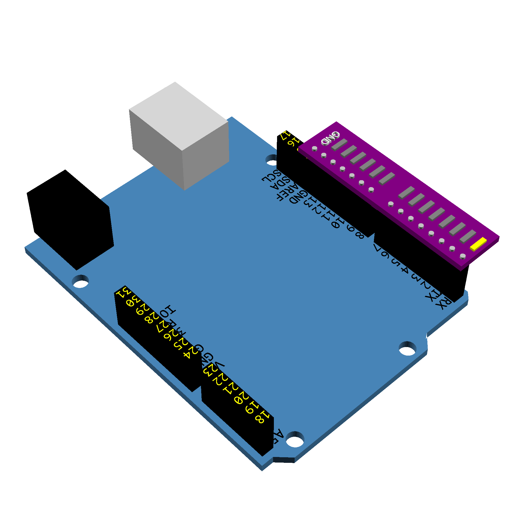
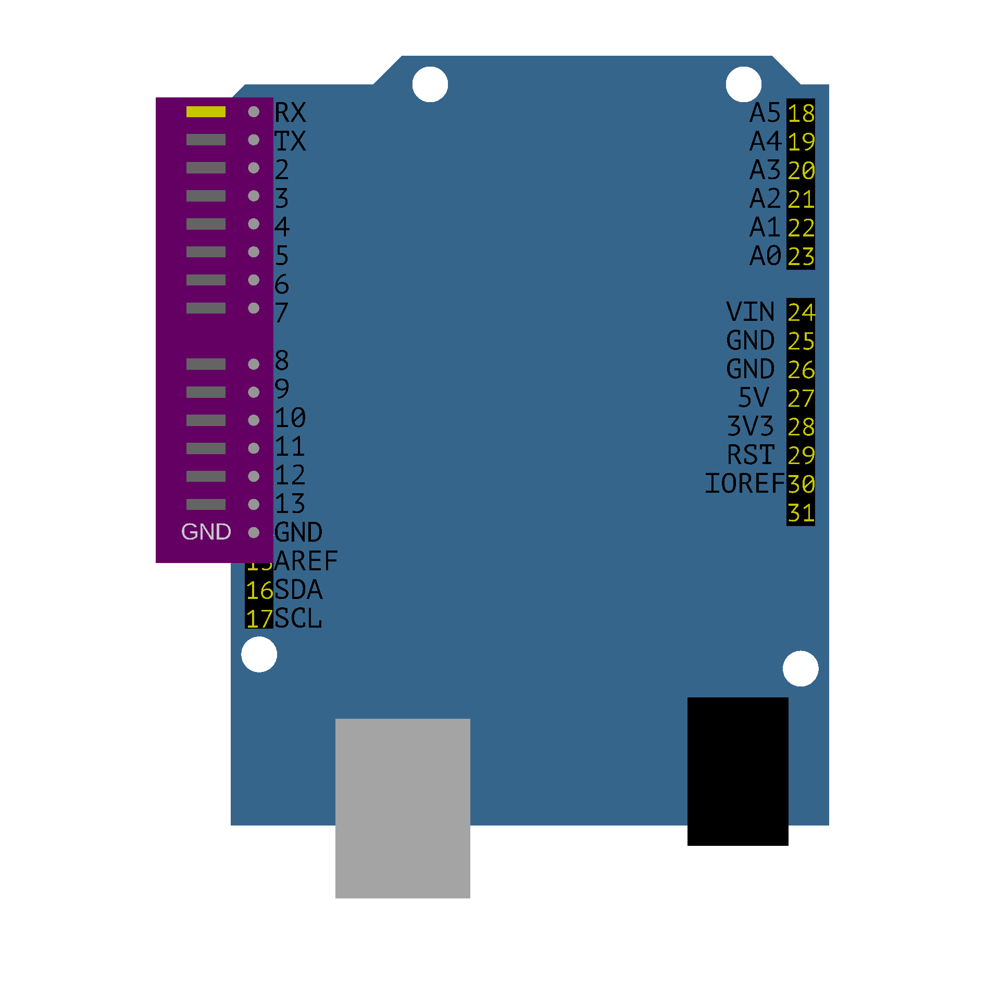

# uno-led-chaser
What this program does:

This program will make only one LED light up at a time from 14 LEDs (pins 0 to 13), and the lit position will move to the next pin every 333 ms.

The execution logic is as follows:

`step` represents the pin number to be lit.

Each time `loop()` is entered, it first checks if `step` exceeds 13. If it does, it resets it to 0.

Then, a `for` loop scans all LED pins: if the current pin is equal to `step`, it sets it to HIGH; otherwise, it sets it to LOW.

Therefore, only one LED will be lit at any given time.

Finally, `step` is incremented, a delay of 333 milliseconds is applied, and then the next loop begins.

# Installation
## Setup Arduino IDE
When using Arduino for the first time, it is recommended to download and install Arduino IDE 2 from the official website. It supports Windows 10 and above, macOS 10.15 and above, and 64-bit Linux. Installation methods vary slightly depending on the operating system: for Windows, usually download the .exe file and follow the instructions; for macOS, open the .dmg file and drag the Arduino IDE into Applications; for Linux, you can use AppImage to execute it. After installation, launch the Arduino IDE, which will be the main development environment for writing, compiling, and uploading programs. [Arduino Help Center](https://support.arduino.cc/hc/en-us/articles/360019833020-Download-and-install-Arduino-IDE)

## Connect the Arduino development board
Next, connect the Arduino development board to your computer using a USB cable capable of transferring data, as a charging cable alone may not be sufficient for uploading programs. Upon first connection, the IDE may prompt you to install the corresponding board package, which is a core support file required for compiling and uploading programs; without it, the program will not compile successfully. Afterward, select the correct board and port in the IDE, such as the Arduino Uno and its corresponding COM port or /dev/tty... port. Once these settings are complete, you can create a new program (Sketch), or first enable built-in programs such as Blink to test if the environment is working correctly. [Arduino Help Center](https://support.arduino.cc/hc/en-us/articles/360019833020-Download-and-install-Arduino-IDE)

## Compile and upload the code
After writing your program, press the Verify button to compile it. Compilation checks your Arduino code for syntax and logic errors and converts it into machine code that the development board can execute. If there are problems, the message window at the bottom of the IDE will display the error message. Once compilation is successful, press the Upload button, and the IDE will transfer the program to the Arduino development board. After uploading, the program will start executing immediately, and will automatically execute again each time the board is powered on or reset. To observe the messages returned by the board, you can also open Serial Monitor for debugging and data viewing. [Arduino Help Center](https://support.arduino.cc/hc/en-us/articles/360019833020-Download-and-install-Arduino-IDE)

## Hardware
An Arduino UNO development board, A 14-bit led single-row array module.

### Connection
Insert the LED single-row array module into PIN 0-13 of the Arduio UNO.

 

### Verification
Open uno_led_chaser.ino using the Ardunio IDE, compile and upload the program, and you will see the LED chaser.